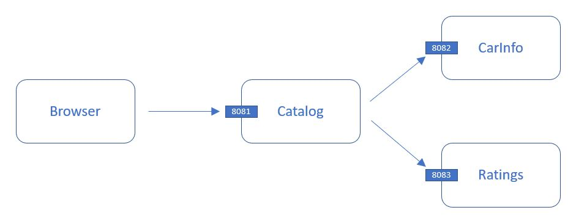

# Microservice practice

## Description

Implements a **Car Rating** system. It contains the folling three (3) microservices:
- Catalog 
- CarInfo
- Ratings

## Build process

Go in the corresponding directory for each module and execute 
**mvn package**

## Versions

#### May 25, 2019
- All three microservices are working (with some hardcoded data). 
- **Catalog** is able to pull data from **CarInfo** and **Ratings**

#### May 28, 2019
- All three microservices are working in Docker environment. 
