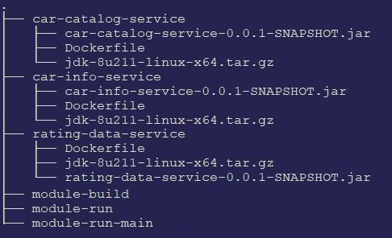

# Testing **Car Rating** project on Docker

## Description

Under each directory (corresponding to each module of the project) a Dockerfile will be found to create the corresponding Docker image

## Steps
Docker tests were executed on Linux (Mint 19):

- Download the appropiate JDK version to run each component (e.g.: **jdk-8u211-linux-x64.tar.gz**)
- Get the proper microservice packaged as jar file   (e.g.: **car-catalog-service-0.0.1-SNAPSHOT.jar**)
- Run the image build script for the microservice    (e.g.: **module-build car-catalog-service**)
- Start the Docker container for each microservice   (e.g.: **module-run car-catalog-service**)
- Test each microservice
  car-catalog-service   http://localhost:8081/catalog/user/1
  car-info-service      http://localhost:8082/CarDesc/1
  rating-data-service   http://localhost:8083/rating/byuser/1 

